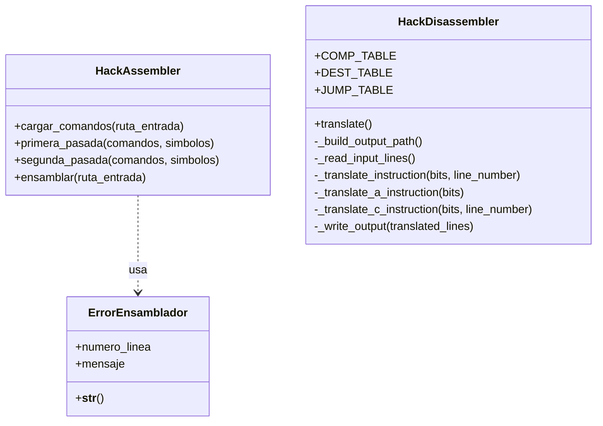

# Diseño

## Diagrama de clases (Assembler + Disassembler)

## Resumen de funcionamiento

### Ensamblador (`HackAssembler.py`)
- Lee un `.asm`.
- Hace dos pasadas para resolver etiquetas/símbolos.
- Traduce A/C a binario y genera `.hack`.
- Si hay error, informa línea y elimina salida parcial.

### Desensamblador (`HackDisassembler.py`)
- Lee un `.hack`.
- Valida formato de línea (16 bits, solo 0/1).
- Traduce instrucciones A/C a `.asm`.
- Genera salida `<nombre>Dis.asm`.
- Si hay error, informa línea y elimina salida parcial.
